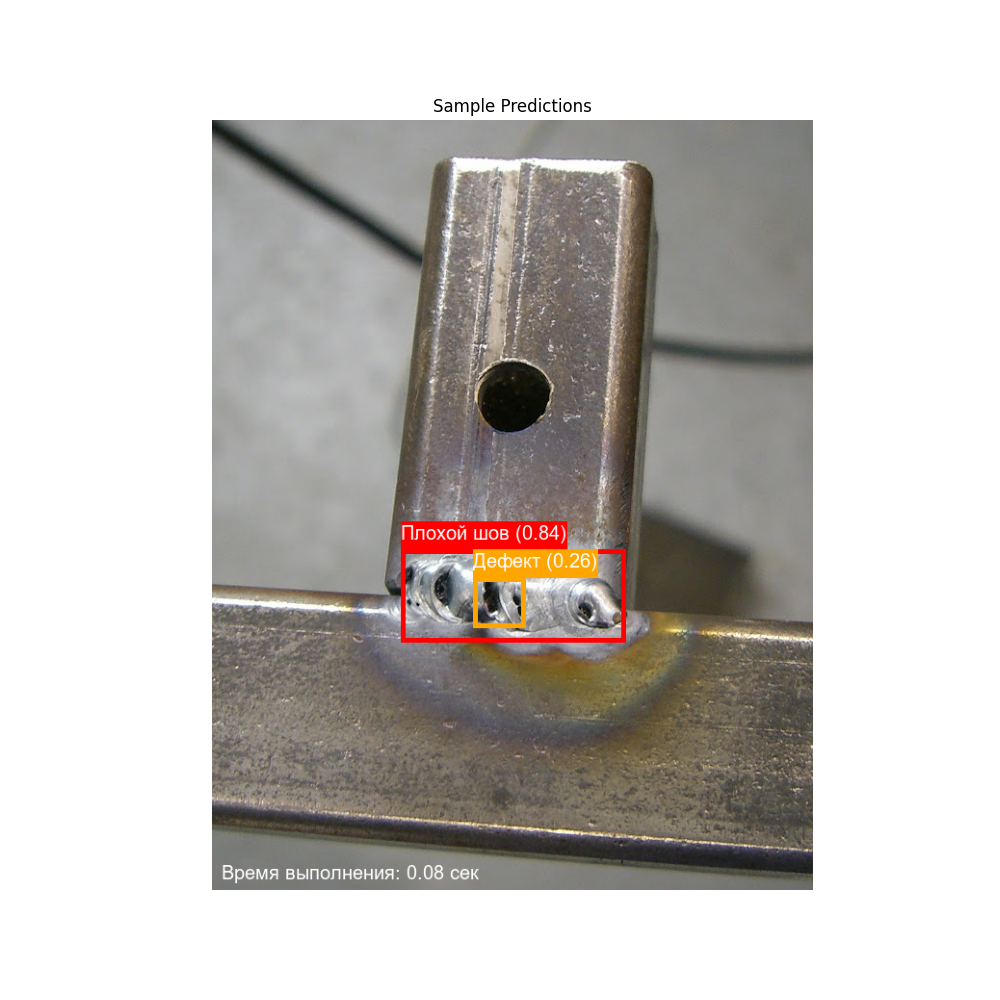
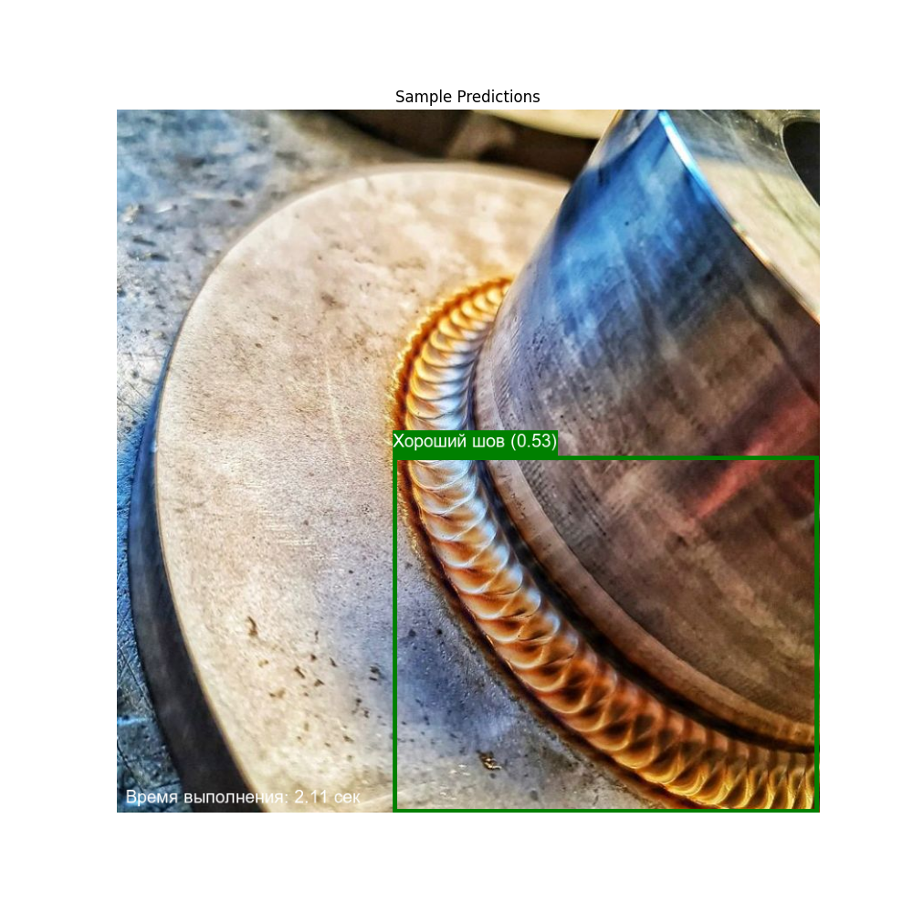
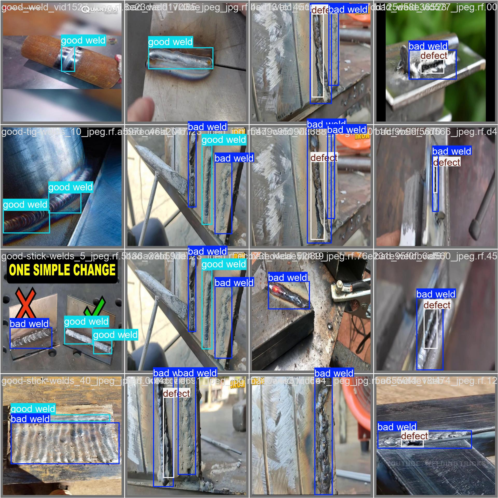
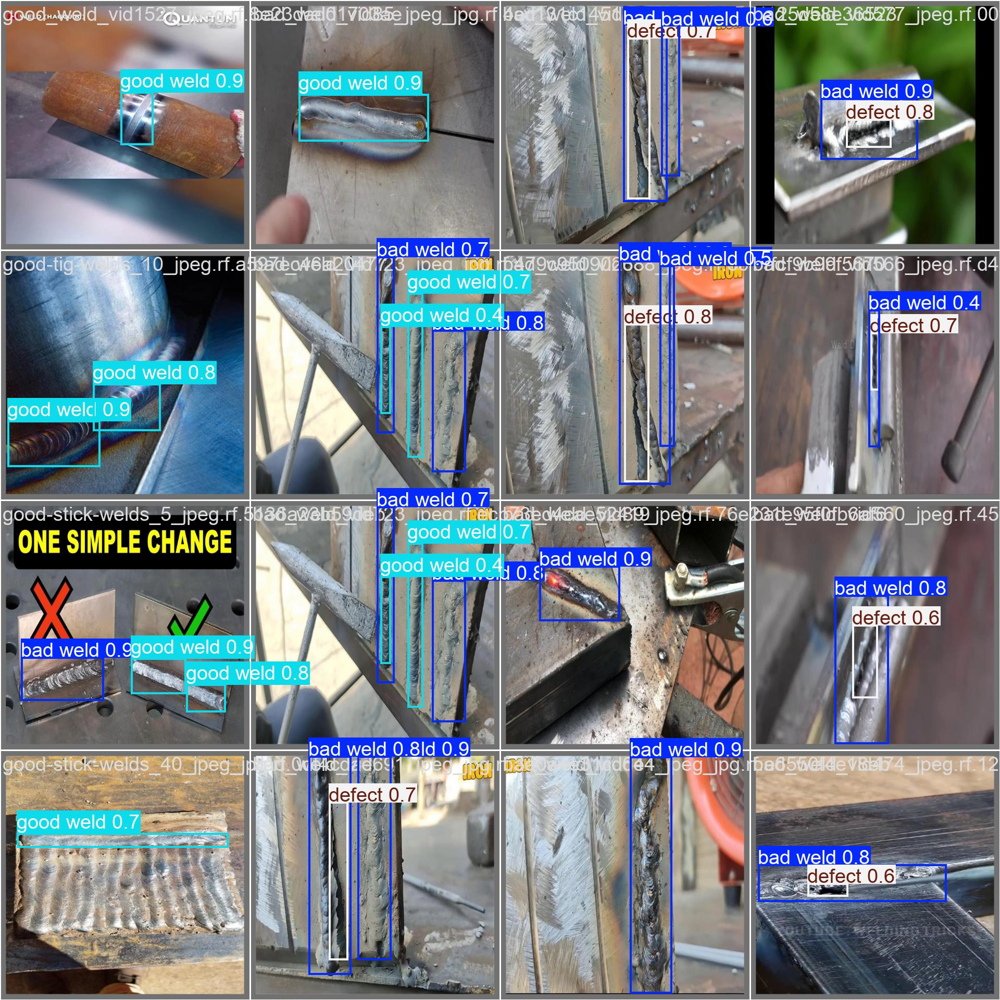

# Welding Defect Detection

## Description

This project is a demonstration application showcasing skills in machine learning tasks. It uses the YOLO model for weld defect detection and demonstrates image processing capabilities with machine learning technologies.

## Dataset

The model was trained using a welding defect dataset available on Kaggle. The dataset contains images of welds with annotations that classify the welds into different defect types. Dataset link: [Welding Defect Object Detection Dataset](https://www.kaggle.com/datasets/sukmaadhiwijaya/welding-defect-object-detection).

### Dataset Description

- **Images:** Contains images of welding seams with various types of defects annotated.
- **Annotations:** Objects are annotated with bounding boxes, indicating the defect class (e.g., "good weld", "bad weld", "defect").
- **Usage:** Used for training and evaluating object detection models such as YOLO.

## Example Image Processing

Below are examples of image processing using the YOLO model:

**Example of a bad weld:**

**Example of a good weld:**

These images showcase the model's ability to detect and classify weld defects. The images include the results of model predictions overlaid on the original images, demonstrating the effectiveness of the YOLO model in identifying different types of weld defects.

## Validation Results

Here are detailed examples showing the results of the model on validation images:

### Validation Image 1: `val_batch1_labels.jpg`

**Description:**

This image displays the ground truth annotations for the validation batch. The annotations include bounding boxes around welding seams with labels indicating their defect class. For this image:

- **Good Welds:** Represented with bounding boxes and labeled accordingly.
- **Bad Welds:** Identified with bounding boxes and labeled as defects.
- **Defects:** Specific areas where defects are identified.

### Validation Image 2: `val_batch1_pred.jpg`

**Description:**

This image shows the model’s predictions for the same validation batch. It includes bounding boxes drawn around detected weld defects and labels indicating the class and confidence of each prediction. For this image:

- **Good Welds:** Boxes and labels showing where the model has identified welds classified as good.
- **Bad Welds:** Boxes and labels indicating welds detected as defects.
- **Defects:** Areas where the model has identified and classified defects.

These images demonstrate how well the YOLO model performs on unseen data, showing the model's ability to generalize and accurately detect weld defects.

## License

This project is licensed under the MIT License. See the [LICENSE](LICENSE) file for details.

---

# Обнаружение дефектов сварки

## Описание

Этот проект является демонстрационным приложением, показывающим навыки работы с задачами машинного обучения. Он использует модель YOLO для обнаружения дефектов сварки и демонстрирует возможности обработки изображений с помощью технологий машинного обучения.

## Датасет

Модель была обучена с использованием датасета дефектов сварки, доступного на Kaggle. Датасет содержит изображения сварочных швов с аннотациями, которые классифицируют швы по различным типам дефектов. Ссылка на датасет: [Welding Defect Object Detection Dataset](https://www.kaggle.com/datasets/sukmaadhiwijaya/welding-defect-object-detection).

### Описание датасета

- **Изображения:** Содержит изображения сварочных швов с аннотированными различными типами дефектов.
- **Аннотации:** Объекты аннотированы прямоугольными рамками, указывающими класс дефекта (например, "хороший шов", "плохой шов", "дефект").
- **Использование:** Используется для обучения и оценки моделей детекции объектов, таких как YOLO.

## Примеры обработки изображений

Ниже приведены примеры обработки изображений с использованием модели YOLO:

**Пример плохого шва:**

**Пример хорошего шва:**

Эти изображения демонстрируют способность модели обнаруживать и классифицировать дефекты сварки. На изображениях показаны результаты предсказаний модели, наложенные на исходные изображения, что демонстрирует эффективность модели YOLO в идентификации различных типов дефектов сварки.

## Результаты валидации

Ниже приведены подробные примеры результатов модели на валидационных изображениях:

### Валидационное изображение 1: `val_batch1_labels.jpg`

**Описание:**

Это изображение показывает аннотации (граундтру) для валидационной партии. Аннотации включают прямоугольные рамки вокруг сварочных швов с метками, указывающими их класс дефекта. Для этого изображения:

- **Хорошие швы:** Представлены прямоугольными рамками и помечены соответствующим образом.
- **Плохие швы:** Обозначены прямоугольными рамками и помечены как дефекты.
- **Дефекты:** Конкретные области, где выявлены дефекты.

### Валидационное изображение 2: `val_batch1_pred.jpg`

**Описание:**

Это изображение показывает предсказания модели для той же валидационной партии. На нем изображены прямоугольные рамки вокруг обнаруженных дефектов сварки и метки, указывающие класс и уверенность каждого предсказания. Для этого изображения:

- **Хорошие швы:** Рамки и метки показывают, где модель идентифицировала сварочные швы как хорошие.
- **Плохие швы:** Рамки и метки указывают на швы, обнаруженные как дефекты.
- **Дефекты:** Области, где модель идентифицировала и классифицировала дефекты.

Эти изображения демонстрируют, как хорошо модель YOLO работает с новыми данными, показывая способность модели обобщать и точно обнаруживать дефекты сварки.

## License

Этот проект лицензирован по лицензии MIT. Смотрите файл [LICENSE](LICENSE) для подробностей.
